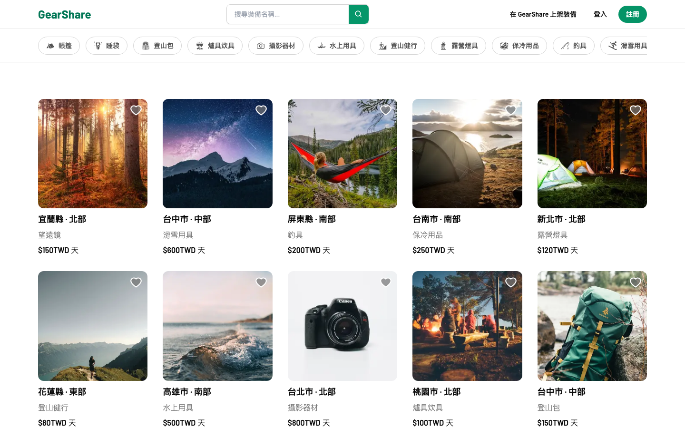
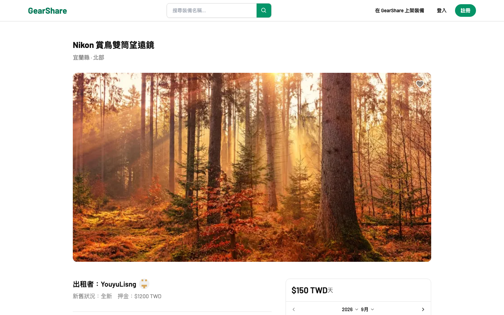

[](https://github.com/YouyuLisng/gearshare/actions/workflows/ci.yml)


# GearShare

**Live demo:** [gearshare-liard.vercel.app](https://gearshare-liard.vercel.app)

A peer-to-peer marketplace for renting outdoor gear (tents, sleeping bags,
cameras, and the like) directly from other people instead of a single shop's
own inventory — think Airbnb, but for the gear you only need for one trip.

Originally scaffolded from a well-known Airbnb-clone tutorial; the data
model, routes, and UI have since been reworked end-to-end around gear
rental instead of property booking (`Gear`/`Rental` instead of
`Listing`/`Reservation`, condition tracking, a deposit lifecycle, LINE Pay
checkout) rather than left as a re-skin.

## Screenshots

| Browse & search | Gear detail |
| --- | --- |
|  |  |

## Features

**Discovery**
- Browse & keyword search gear across categories, with pagination
- Filter by category and pickup region (Taiwan county/city picker)
- Interactive map (MapLibre GL) showing a listing's pickup area
- Favorites

**Renting a listing**
- List gear you own, with multi-image upload (Cloudinary)
- Book a date range; a deposit is calculated alongside the daily rate
- Pay the deposit + rental fee through LINE Pay
- In-app messaging between renter and lender per rental
- Real-time-ish notifications (in-app + email via Resend) for booking,
  message, and return events
- Track what you're renting, what others are renting from you, and what
  you've listed, each with a proper rental status machine
  (pending → active → returned/cancelled) and cancellation flow

**Trust**
- Once gear is returned, the lender records its condition and the deposit
  is automatically refunded or forfeited
- Post-rental reviews and ratings

**Account**
- Email/password and GitHub OAuth sign-in
- Profile editing (name, avatar, password change)

## Tech stack

- **Framework**: Next.js 16 (App Router, Turbopack), React 19, TypeScript 6
- **Data**: Prisma 5 + MongoDB Atlas
- **Auth**: next-auth v4 (JWT sessions, credentials + GitHub OAuth)
- **UI**: Tailwind CSS v3, shadcn/ui (Radix primitives), MapLibre GL JS
- **State/data-fetching**: SWR (polling-based live-ish updates for
  messages/notifications), Zustand (modal state), react-hook-form
- **Payments**: LINE Pay v3 API
- **Email**: Resend
- **Testing**: Vitest (unit) + Playwright (E2E), both wired into CI

## Testing

```bash
npm run test           # unit tests (Vitest) -- Prisma is mocked, no DB needed
npm run test:watch     # unit tests in watch mode
npm run test:coverage  # unit tests with a coverage report (text + html)
npm run test:e2e       # E2E suite (Playwright), needs a running app + DATABASE_URL
```

77 unit tests cover the API route handlers and shared libs (`app/api/**`,
`app/libs/**`) — currently ~69% statement coverage there, with server
actions, non-trivial UI logic, and full user flows covered by the E2E
suite instead. The E2E suite (10 specs: auth, browsing/search/filtering,
favoriting, the gear-listing wizard, plus protected-route redirects) runs
against a real, freshly-seeded database and a production build.

Both suites run in CI (`.github/workflows/ci.yml`) alongside lint, a
standalone typecheck, and the production build itself. CI provisions a
single-node MongoDB replica set via `docker run` (GitHub Actions'
`services:` key can't override a service container's startup command,
and Prisma's MongoDB connector needs a replica set for transactions),
syncs the schema, seeds E2E fixtures, then runs Playwright against
`next start`.

## Getting started

```bash
npm install
npm run dev
```

Open [http://localhost:3000](http://localhost:3000). You'll need a `.env`
with `DATABASE_URL` (MongoDB), NextAuth secrets, and GitHub OAuth
credentials at minimum — see `.env.example` for the full list, including
the optional LINE Pay and Resend integrations (both no-op gracefully
without their API keys, so they're not required for local dev).

## Deploying (Vercel)

1. **Database**: use a MongoDB Atlas cluster reachable from the internet
   — Vercel's serverless functions don't have a static IP, so under
   Atlas's Network Access settings, allow `0.0.0.0/0` (or use Atlas's
   Vercel integration, which manages this for you).
2. **Import the repo** into Vercel (Next.js is auto-detected, no
   `vercel.json` needed).
3. **Environment variables** — set everything in `.env.example` for the
   Production environment, plus:
   - `NEXTAUTH_URL` — your production URL (e.g. `https://gearshare.vercel.app`)
   - `NEXT_PUBLIC_BASE_URL` — same URL; used for LINE Pay's return
     redirect and for building absolute links in notification emails
4. **OAuth callback URLs** — update the GitHub OAuth App's callback URL
   to `https://<your-domain>/api/auth/callback/github`.
5. **LINE Pay** — if enabling checkout, switch `LINE_PAY_ENV` to
   `production` and use production Channel ID/Secret; the Sandbox
   credentials only work against LINE Pay's sandbox environment.
6. Deploy. `postinstall` runs `prisma generate` automatically.
